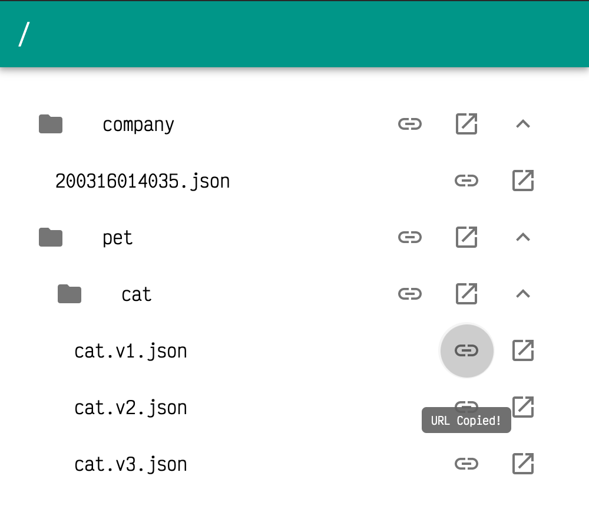

> # ⚠️ This repository has been archived. GitLab Interactive API documentation is recommended to use.

# Swagger Dir

> A Swagger.io Directory Browser

Please read the documentation on the official site: <https://github.com/VdustR/swagger-dir>

Browser Swagger files with the simple web server. [Swagger UI](https://swagger.io/tools/swagger-ui/) is built-in. It's a easy way to manage your Swagger API documents. Just put them in a folder and start the server. Now you can check and share them easily.

## Packages

- [@swagger-dir/core](./packages/core/README.md) - A node library for swagger dir
- [swagger-dir](./packages/cli/README.md) - A node CLI for swagger dir
